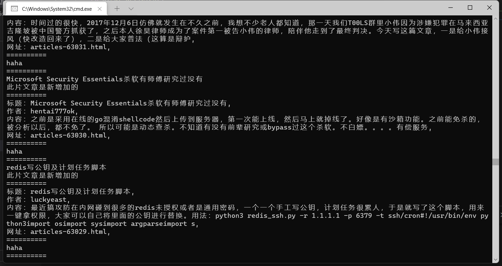
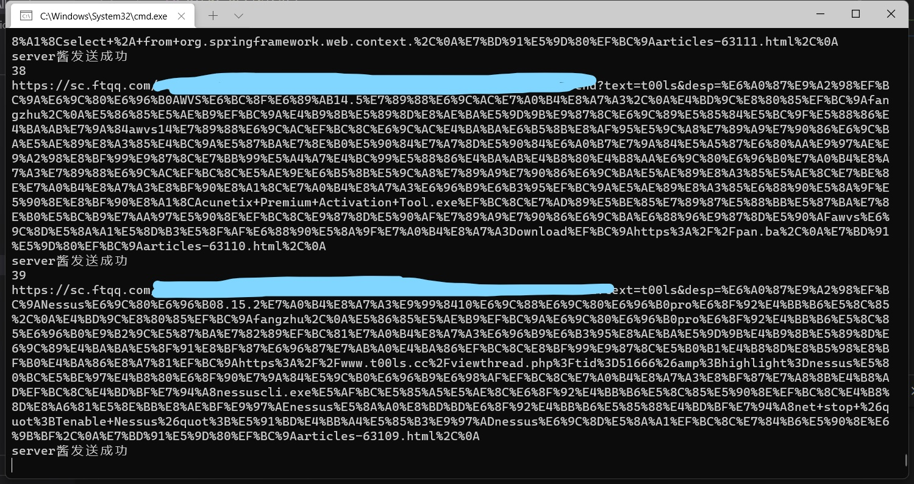
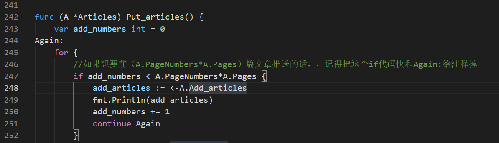
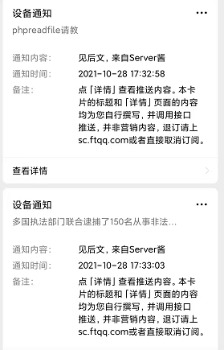
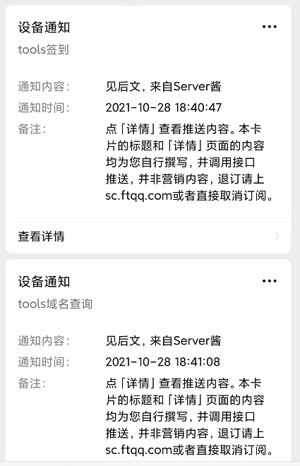
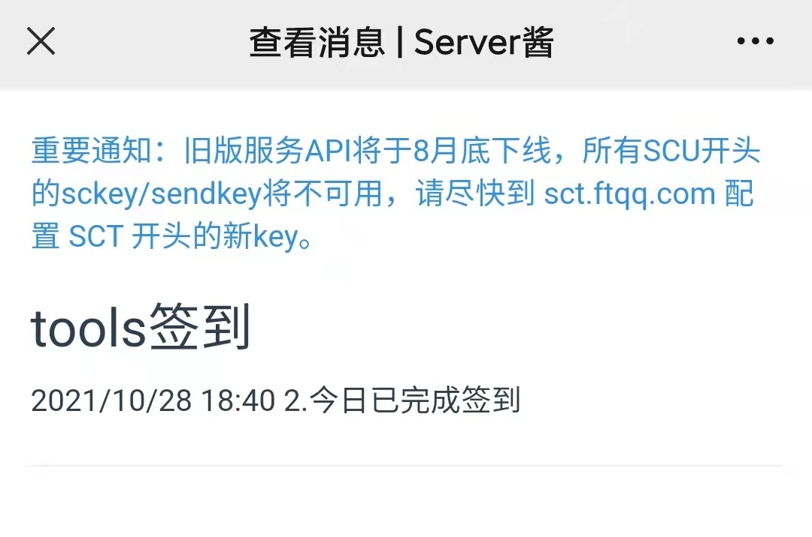
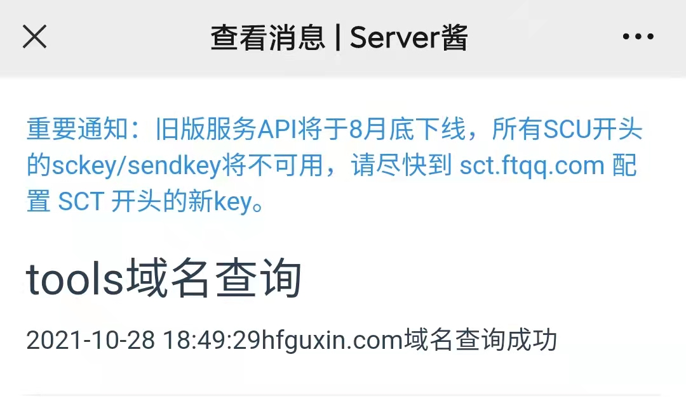

# T00LS文章更新提醒，自动签到，域名查询

### 此程序是基于，T00LS的api和server酱api实现，程序自动签到，和新文章更新提醒


#### 此版本，是一晚上赶工做出来的，突然懒癌发作不想一页一页翻论坛，就写个程序，可能代码有些凌乱，下一个版本会整改下代码，并且添加多个提醒api，钉钉机器人推送，server酱推送，Telegram机器人推送，配置文件将会单独开一个yaml文件

### main.go中可以配置

```go
	action      = "login"
	username    = "kosakd"                                                  //用户名
	password    = "e10adc3949ba59abbe56e057f20f883e"                        //密码md5 32位
	questionid  = "1"                                                       //安全问题ID，默认0为未设置
	answer      = "kosad"                                                  	//安全问题答案
	//支持server酱的SCU/SCT的key，和push+的Token
	sendkey     = "SCUxxxxxxxxxxxxxxxxxxx" 									//Server酱sendkey
	Url         = "https://www.t00ls.cc/All-articles.json"                  //api的url
	ToolsUrl    = "https://www.t00ls.cc"                                    //tools的url
	Pages       = 10                                                        //获取的页数
	PageNumbers = 10                                                        //每页获取多少条数据
```


### 运行

```powershell
git clone https://github.com/kosakd/T00ls.git
cd T00ls
linux:
go env -w GOOS=linux
go build -o tools main.go
chmod 777 tools&&./tools
windows:
go env -w GOOS=windows
go build -o tools.exe main.go
tools.exe
```







#### 建议布置在云函数上，执行一次，会一直循环，签到脚本会每过24小时执行一次，文章更新会每15分钟查询一次

```shell
再自己的服务器上布置
go env -w GOOS=linux
go build -o main main.go
chmod 777 main
nohup main &
```

```shell
云函数布置
go env -w GOOS=linux
go build -o main main.go
zip main main.zip
选择go，直接上传zip包，布置函数就行
```

### 最后，如果想要看文章推送的效果，可以把GetAllArticles.go，文件中的Put_articles()的注释













### 一个很简单go程序
